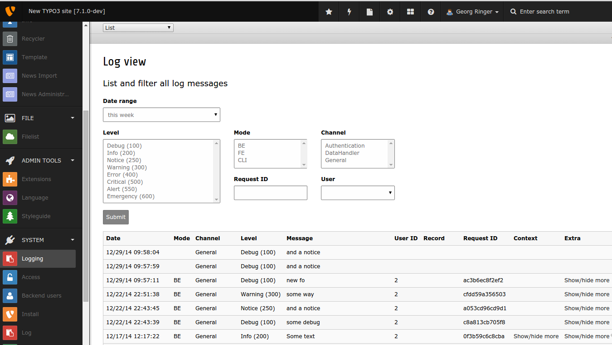
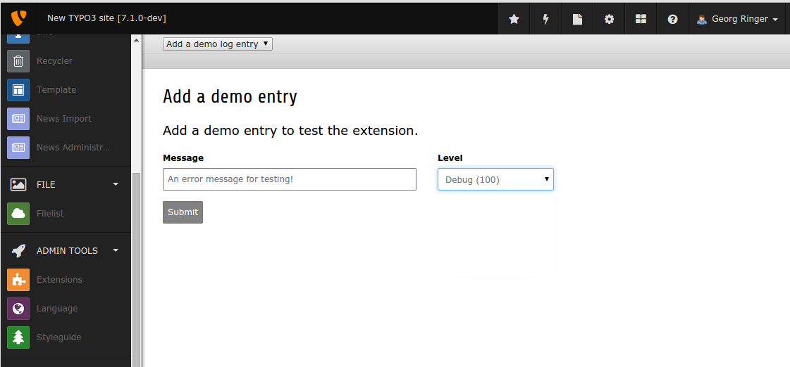

.. ==================================================
.. FOR YOUR INFORMATION
.. --------------------------------------------------
.. -*- coding: utf-8 -*- with BOM.

=========================
TYPO3 Extension "logging"
=========================

About
-----

This extensions brings the awesome project  `monolog <https://github.com/Seldaek/monolog>`_ into the world of TYPO3 CMS.

The most important features are:

* Full support of monolog, including all handlers and processors
* A custom handler to write into the database of TYPO3
* A backend module to list & filter the entries

.. image:: https://travis-ci.org/georgringer/logging.svg

Screenshots
^^^^^^^^^^^

:alt: Screenshot of the backend module

:alt: Create a test entry

Requirements
^^^^^^^^^^^^

* TYPO3.CMS 7.6+
* Your project set up with composer and `monolog/monolog` as requirement. ::

	"config": {
		"vendor-dir": "Packages/Libraries",
		"bin-dir": "bin"
	},
	{
	  "repositories": [
		{
		  "type": "composer",
		  "url": "http://composer.typo3.org/"
		},
		{
		  "url": "https://github.com/georgringer/logging.git",
		  "type": "git"
		}
	  ],
	  "require": {
		"typo3/cms": "7.1",
		"georgringer/logging": "dev-master",
		"monolog/monolog": "*"
	  }
	}

.. hint::
It might be possible that a later release will bring support for 6.2 LTS.

Installation
^^^^^^^^^^^^

Install the extension as always.  Currently (state of 7.2), packages installed via composer are automatically loaded. For 6.2 LTS, set the environment variable `TYPO3_COMPOSER_AUTOLOAD` to 1, e.g. in your `.htaccess`: ::

	SetEnv TYPO3_COMPOSER_AUTOLOAD 1

Configuration
-------------

The configuration can be added to your `typo3conf/AdditionalConfiguration.php` file. The API is inspired by the
current Logging framework of TYPO3 CMS.

The following logging levels are available: ::

	* Debug (100)
	* Info (200)
	* Notice (250)
	* Warning (300)
	* Error (400)
	* Critical (500)
	* Alert (550)
	* Emergency (600)

Simple file logger
^^^^^^^^^^^^^^^^^^

This is the configuration of a simple file logger which is written to `typo3temp/out.log`. ::

	$GLOBALS['TYPO3_CONF_VARS']['MONOLOG'] = array(
		'handlerConfiguration' => array(
			'name' => 'General',
			'handlers' => array(
				\Monolog\Handler\StreamHandler::class => array(
					'configuration' => array(
						PATH_site . 'typo3temp/out.log',
						\Monolog\Logger::ERROR
					)
				)
			)
		)
	);

Every call will be logged where the level is at least ERROR (400).

**Important:** Take care if logging to a file which is available in a public directory with no access restriction!!

Log to the database
^^^^^^^^^^^^^^^^^^^

Sometimes it makes sense to log to the database. You can do that with the following configuration: ::

   $GLOBALS['TYPO3_CONF_VARS']['MONOLOG'] = [
      'processorConfiguration' => [
         \GeorgRinger\Logging\Log\Monolog\Processor\Typo3Processor::class => []
      ],
      'handlerConfiguration' => [
         'name' => 'General',
         'handlers' => [
            \GeorgRinger\Logging\Log\Monolog\Handler\DatabaseHandler::class => []
         ]
      ]
   ];

The **Typo3Processor** will add additional information to the log entry:

	* An *internal process id* of TYPO3 which will allow to filter all log entries within a single request
	* The *IP* of the client
	* The *TYPO3 mode* which is either BE, FE or CLI
	* The *ID* of an existing backend or frontend user

Combined example
^^^^^^^^^^^^^^^^

The logging framework allows to combine multiple handlers. Logging helps you not only while building a website or
application but also during its whole lifetime! Especially on production sites it is likely that you can't use commands
like *print_r* or *die()*.

You might ignore debugging information, write warnings to a file and send errors via mail to yourself: ::

	$GLOBALS['TYPO3_CONF_VARS']['MONOLOG'] = array(
		'processorConfiguration' => array(
			\GeorgRinger\Logging\Log\Monolog\Processor\Typo3Processor::class => array()
		),
		'handlerConfiguration' => array(
			'name' => 'General',
			'handlers' => array(
				\Monolog\Handler\NativeMailerHandler::class => array(
					'configuration' => array(
						'admin@example.org',
						'Error from website',
						'no-reply@example.org',
						\Monolog\Logger::ERROR
					),
				),
				\Monolog\Handler\StreamHandler::class => array(
					'configuration' => array(
						PATH_site . 'typo3temp/out.log',
						\Monolog\Logger::WARNING
					),
				),
				\Monolog\Handler\SocketHandler::class => array(
					'configuration' => array(
						'tcp://127.0.0.1:7000'
					),
					'formatter' => array(\Monolog\Formatter\LogstashFormatter::class, array('Application', 'System')),
				),
			)
		)
	);

Loggers depending on class called
^^^^^^^^^^^^^^^^^^^^^^^^^^^^^^^^^

As in the `current logging framework <http://docs.typo3.org/typo3cms/CoreApiReference/ApiOverview/Logging/Configuration/Index.html>`_ of TYPO3 CMS it is also with this extension possible to configure a different
logging behaviour for different classes. An example would be to log all warnings to a file but
for one important extension those warnings should also be sent as email.

Therefore, add the namespace of the specific extension to the logging configuration: ::

	$GLOBALS['TYPO3_CONF_VARS']['MONOLOG'] = array(
		'handlerConfiguration' => array(
			'name' => 'General',
			'handlers' => array(
				\Monolog\Handler\StreamHandler::class => array(
					'configuration' => array(
						PATH_site . 'typo3temp/out.log',
						\Monolog\Logger::WARNING
					)
				)
			)
		)
	);
	$GLOBALS['TYPO3_CONF_VARS']['MONOLOG']['GeorgRinger']['Shop'] = array(
		'handlerConfiguration' => array(
			'name' => 'Important Extension',
			'handlers' => array(
				\Monolog\Handler\NativeMailerHandler::class => array(
					'configuration' => array(
						'admin@example.org',
						'Error from website',
						'no-reply@example.org',
						\Monolog\Logger::WARNING
					)
				),
				\Monolog\Handler\StreamHandler::class => array(
					'configuration' => array(
						PATH_site . 'typo3temp/out.log',
						\Monolog\Logger::WARNING
					)
				)
			)
		)
	);

In the example above, every logging call within the namespace of `GeorgRinger\Shop` will trigger the 2nd configuration.
All other calls will be handled by the first configuration.

How to log
----------

Logging is very simple and similar to the used logging framework: ::

	/** @var \Monolog\Logger $logger */
	$logger = GeneralUtility::makeInstance(\GeorgRinger\Logging\Log\MonologManager::class)->getLogger(__CLASS__);
	$logger->info('Some text', array('additional information' => 123));

Available methods for logging
^^^^^^^^^^^^^^^^^^^^^^^^^^^^^

The following methods are available for logging. The *context* is an optional array with additional information.

**Debug** ::

	$logger->addDebug($message, $context);
	$logger->debug($message, $context);

**Info** ::

	$logger->addInfo($message, $context);
	$logger->info($message, $context);

**Notice** ::

	$logger->addNotice($message, $context);
	$logger->notice($message, $context);

**Warning** ::

	$logger->addWarning($message, $context);
	$logger->warn($message, $context);
	$logger->warning($message, $context);

**Error** ::

	$logger->addError($message, $context);
	$logger->err($message, $context);
	$logger->error($message, $context);

**Critical** ::

	$logger->addCritical($message, $context);
	$logger->crit($message, $context);
	$logger->critical($message, $context);

**Alert** ::

	$logger->addAlert($message, $context);
	$logger->alert($message, $context);

**Emergency** ::

	$logger->addEmergency($message, $context);
	$logger->emerg($message, $context);
	$logger->emergency($message, $context);

Contribute!
-----------

Any contribution is highly welcomed.
Please use the issue tracker of the `GitHub Project <https://github.com/georgringer/logging/issues>`_!

If this extension is helpful for your, don't hesitate to donate!
